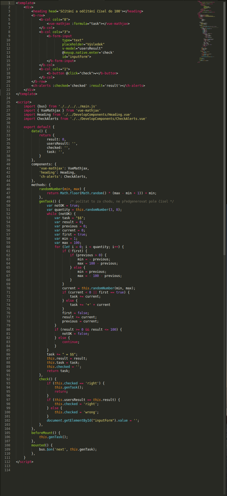
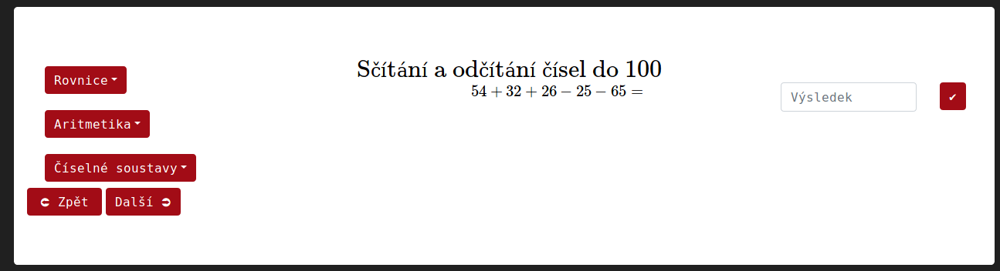

Computatis
==========

Toto je můj maturitní projekt.

## Instalace

```bash
# git clone této složky
git clone https://github.com/kubajj/Computatis.git

# přesun do složky
cd Computatis

# instalace projektu
npm install

# spuštění lokálně
npm run dev
```

## Vývoj
Aplikace je psána ve Vue.js. Předpokladem pro úspěšný vývoj rozšíření je ale pouze znalost javascriptu a HTML.

[Vue](https://vuejs.org/v2/guide/) [JS](https://www.w3schools.com/js/) [HTML](https://www.w3schools.com/html/)

Jděte na [Computatis Development Project](https://github.com/kubajj/ComputatisDevelopmentProject), kde naleznete projekt pro snažší vývoj.

Aplikace je rozdělena na několik vrstev. Nejdůležitější je nejnižší vrstva, která se nachází ve složce PracContentFiles, kde se nacházejí jednotlivé složky s příklady.
Úkolem vývojáře je nezasahovat do ničeho jiného, než do jednotlivých komponentů nebo složek s komponenty (můžete si vytvořit vaši vlastní).

<!--Zde můžete vidět náhled kódu jednoho z funkčních komponentů:
-->
```html
<template>
	<div>
		<heading head='Lineární rovnice'></heading>
		<b-row>
			<b-col cols='8'>
				<vue-mathjax :formula="task"/> <!-- tato značka umožňuje zobrazit uživateli 
				zadání v Latexu -->
			</b-col>
		</b-row>
		<b-row>&nbsp</b-row>
		<b-row>
			<b-col cols='8'><!-- následující značka ukáže tlačítko pro spuštění nápovědy 
			a popíše jeho funkci -->
				<span v-if='!hinted' @click='hint' class='hintstyle'>Nápovědu prosím</span>
				<span v-else><vue-mathjax :formula="hintValue1"/></span>
			</b-col>
			<b-col cols="3"><!--následující část vygeneruje fomrulář pro zapsání a kontrolu 
			výsledku -->
				<b-form-input
		                type="text"
		                placeholder="Výsledek"
		                v-model="usersResult"
		                @keyup.native.enter='check'
		                id="inputForm">                   	
		        </b-form-input>
		    </b-col>
	        <b-col cols="1"><!-- tato značka vygeneruje tlačítko pro potvrzení výsledku -->
	        	<b-button @click="check">✔</b-button>
	        </b-col>
		</b-row>	
		<ch-alerts :checked='checked' :result='result'></ch-alerts><!-- tato značka volá 
		ch-alerts komponent, 
		který buď uživateli oznámí chybu a ukáže správný výsledek, nebo ukáže hlášku: 
		"Správně" -->
	</div>
</template>

<script>/*následující řádky uvádí, které komponenty se musí naimportovat, tyto komponenty 
		musí být upřesněny ještě v sekci components*/
	import { bus } from './../../../main.js'
	import { VueMathjax } from 'vue-mathjax'
	import Heading from './../DevelopComponents/Heading.vue'
	import CheckAlerts from './../DevelopComponents/CheckAlerts.vue'

	export default {
		data() {
			return {
				task: '',
				usersResult: '',
				checked: '',
				result: '',
				hinted: false,
				hintValue1: '',/*tato proměnná ukládá string, který je tvořen počtem 
				neznámých (x), znaménkem "=" a hodnotě, které daný počet neznámých 
				odpovídá*/
			}
		}, 
		components: {
			'heading': Heading,
			'ch-alerts': CheckAlerts,
		},
		methods: {
			randomNumber(min, max) { /*tato metoda generuje náhodné číslo (celé) z intervalu, 
				který je specifikován v závorkách*/
				return Math.floor(Math.random() * (max - min + 1)) + min;
			},
			sign() { /*tato metoda je schopna na požádání vrátit 1 nebo -1, usnadňuje tím 
						prevenci toho, aby nebyly generovány proměnné s hodnotou 0*/
				var arr = [1, -1];
				var rnd = this.randomNumber(0,1);
				return arr[rnd]; //it returns 1 or -1
			},
			variants() { /*tato metoda rozhoduje, zda bude k následujícímu náhodnému číslu 
							přiřazeno 'x', nebo ne*/
				var arr = ['x', 'n'];
				var rnd = this.randomNumber(0,1);
				return arr[rnd];
			},
			position() {	//b == před (anglicky => before) "=", a == po "=" (anglicky => after)		
				var arr = ['b', 'a'];
				var rnd = this.randomNumber(0,1);
				return arr[rnd];
			},
			resetAll() { /*tato metoda změní hodnotu proměnných, které před každým zavoláním 
				metody genTask musí mít původní hodnotu, na hodnotu, která je jim přidělena 
				v sekci data*/
				this.checked = '';
				this.usersResult = '';				
				this.task = '';
				this.result = '';
				this.hinted = false;
			},
			hint() { //ukáže nápovědu
				this.hinted = true;
			},
			genTask() { //tato metoda generuje zadání
				this.resetAll();
				var quantity = this.randomNumber(1, 5);
				var rationalResult = false; /*výsledek musí být číslo, které lze zapsat zlomkem, 
				který má ve jmenovateli čísla: 1, 2, 4 -> usnadňuje zadávání výsledků uživatelem 
				do formuláře*/
				while (!rationalResult) { /*pokud výsledek neodpovídá výše zmíněné podmínce, je 
					vygenerována nová rovnice*/
					var xs = this.randomNumber(1, 50)*this.sign();
					var firstx = this.controlX(xs);
					var firstnum = this.randomNumber(1, 50)*this.sign();
					var tmpstringb = '$$' + firstx + 'x'; 
					var tmpstringa = '=' + firstnum;
					var numbers = firstnum;
					for (let i = 1; i < quantity; i++) { /*generuje náhodná čísla a přidává je do 
						dočasných (tmp) stringů*/
						var tmpnumber = this.randomNumber(1, 50)*this.sign();
						var tmpvalue = '';
						var variant = this.variants()
						if (variant == 'x') {
							var currentX = this.controlX(tmpnumber);
							if (tmpnumber < 0) {
								tmpvalue += tmpnumber + 'x';
							} else {
								tmpvalue += '+' + tmpnumber + 'x';
							}
						} else {
							if (tmpnumber < 0) {
								tmpvalue += tmpnumber;
							} else {
								tmpvalue += '+' + tmpnumber;
							}						
						}
						if (this.position() == 'b') {
							if (variant == 'x') {
								xs += tmpnumber;
							} else {
								numbers -= tmpnumber;
							}
							tmpstringb += tmpvalue;
						} else {
							if (variant == 'x') {
								xs -= tmpnumber;
							} else {
								numbers += tmpnumber;								
							}
							tmpstringa += tmpvalue;
						}
					}
					var x = (numbers / xs); //spočítá hodnotu výsledku
					if ((x % 1 == 0 || x % 1 == 0.5 || x % 1 == 0.25) && numbers != 0) {
						rationalResult = true;
						this.task = tmpstringb + tmpstringa + '$$'
						if (xs < 0) {
							xs = - xs;
							numbers = -numbers;
						}
						if (xs == 1) {
							xs = '';
						} 
						if (xs == -1) {
							xs = '-';
						}
						this.hintValue1 = '$$' + xs + 'x = ' + numbers + '$$';
						break;
					} else {
						continue;
					}
				}
				this.result = x;
			},
			controlX(x) { /*tato metoda zamezí zobrazení +1 nebo -1 před neznámou -> má pouze 
				estetickou funkci*/
				if (x == 1) {
					return '';
				} else if (x == -1) {
					return '-';
				} 
				return x;
			},
			check() {
				if (this.checked == 'right') { /*pokud je výsledek, který uživatel odeslal 
					správný, a uživatel znovu stlačí klávesu enter (nebo znovu potvrdí 
					výsledek pomocí tlačítka), ukáže uživateli další příklad*/
					this.genTask();
					return;
				}
				if (this.usersResult == this.result) { /*zkrontroluje, jestli je výsledek, 
					který uživatel zadal, správný*/
					this.checked = 'right';
				} else {
					this.checked = 'wrong';
				}
				document.getElementById("inputForm").value = '';
			}, 
		},
		beforeMount() { //vygeneruje první zadání, když se komponent načte
			this.genTask();
		},
		mounted() { //umožní komponentu PracContent.vue zavolat metodu genTask
		    bus.$on('next', this.genTask);
		},  
	}
</script>


<style>
	.result {
		margin-top: 50px;
	}
</style>
```

V následující části dokumentace bude podrobně rozebrán.
### HTML
První část definuje uspořádání stránky. Tedy spíše následujícího bílého boxu na stránce:


Tato část je ohraničena dvěmi značkami:
```html
<template>
	...
</template>
```

V aplikaci je použit [bootstrap-vue](https://bootstrap-vue.js.org/docs). Prosím, zachovejte tento framework.
Nejdůležitější značky jsou:
```html
<!-- v sekci Layout and Grid System* -->
<b-row>
	...
</b-row>

<b-col cols=''>
	...
</b-col>

<!-- v sekci Form** -->
<b-form-input>
	...
</b-form-input>
```
\*[Layout and Grid System](https://bootstrap-vue.js.org/docs/components/layout)\
\*\*[Form](https://bootstrap-vue.js.org/docs/components/form)

#### Mathjax
Veškeré texty, které chcete vypsat v LATEXu musíte [nabindovat](#Bind) do tohoto komponentu:
```html
<vue-mathjax :formula="var*"/>
```

\*vámi zvolená proměnná - specifikujete ji v sekci [data](#data)\
Proměnná musí být v platném LATEXovém tvaru.\
Začne '$$ a skončí $$'.\
Všechna zpětná lomítka `\` musí být zdvojena.\
Příklad takovéto proměnné:
```javascript
discriminant: '$$x_{1;2} = {-b \\pm \\sqrt{b^2-4ac} \\over 2a}$$',
```

Bindovala by se tedy takto:
```html
<vue-mathjax :formula="discriminant"/>
```

Můžete ale také používat i tzv. [vývojářské komponenty](#vývojářské-komponenty):
```html
<nbsp>
	...
</nbsp>

<hint-form>
	...
</hint-form>

<!-- A v neposlední řadě velmi důležitý komponent, který sjednocuje nadpisy jednotlivých příkladů. -->
<heading>
	...
</heading>
```

**Pozor! Je důležité všechny vývojařské komponenty správně naimportovat (bude vysvětleno následovně).** 

### Import
Část komponentu, která mu říká, které další komponenty a soubory si musí naimportovat je vkládána přímo za tuto značku:
```html
<script>
```

Pokud nepoužíváte [vývojářský projekt](https://github.com/kubajj/ComputatisDevelopmentProject), tak naimportujte následující:
```javascript
	import { bus } from './../../../main.js'
	import { VueMathjax } from 'vue-mathjax'
	import Heading from './../DevelopComponents/Heading.vue'
	import CheckAlerts from './../DevelopComponents/CheckAlerts.vue'
```
Jsou to soubory nezbytné pro správný chod příkladu.

Obecně import probíhá následovně:
``` javascript
import name* from 'path**'
```
\* název, který budete používat - *ideálně stejný nebo podobný názvu souboru, používá se CamelCase*\
\*\*relativní cesta k souboru


### Vue
Tato část je vkládána přímo za importy. Po jejím ukončení ukončete i script část pomocí `</script>`\

Začíná takto:
```javascript
	export default {
```

Dále můžete specifikovat tyto části:
```javascript
	data() {
		return {
			...
		}
	},
	components: {
		...
	},
	methods: {
		...
	},
	computed: {
		...
	},	
```
Funkce těchto jednotlivých částí nyní rozeberu.\

**Každou část ukončete složenou závorkou a čárkou.** `},`

#### Data
V části data můžete specifikovat jednotlivé proměnné.
Používá se javascriptový zápis pro objekty:
``` javascript
name*: value**,
``` 
\*name = jméno proměnné\
\*\*value = hodnota proměnné
*Všechny řádky ukončujte čárkou.*\
Více o javascriptových objektech naleznete [zde](https://www.w3schools.com/js/js_objects.asp).

Na takto definované proměnné můžete odkazovat dvěma způsoby:
1. `this.var*`
2. `this.$data.var*`\
\*var = název proměnné\
Pokud na ně odkazujete z HTML části, prefix `this.` se nepřidává (ani `$data.`).

#### Komponenty
V této části můžete (*je to nutné pro jejich používání*) specifikovat názvy naimportovaných komponentů.
Zápis takovéto specifikace:
```javascript
'heading': Heading,
//tedy:
'var-name*': ImportedVarName**,
```
\* var-name -> název komponentu, který chcete používat v HTML části\
př.`'heading'` používá tzv. kebab-case.

\*\* ImportedVarName -> Název, kterým jste ho popsal v Importu\

*Všechny řádky ukončujte čárkou.*

##### Vývojářské komponenty
U každého komponentu zde specifikuji tzv. [props](https://vuejs.org/v2/guide/components-props.html) a funkci.
Props (*properties*) jsou data, které nadřazený komponent (*parent*) posílá podřadným komponentům (*child*).

###### **Heading.vue**
Props:	
- head (`String`)
```javascript
props: ['head'],
```
Funkce: Upraví vámi nabindovaný nadpis do LATEXového tvaru a tím z něj vytvoří stylový nadpis, který vypadá jako všechno ostatní. \
*Používejte prosím značku `\\text {}` pro zachování mezer*

###### **CheckAlerts.vue**
Props: 	
- checked (`String`) 
	- možné hodnoty:
		- 'right'
		- 'wrong'
- result (převážně `Integer`, ale lze i `String`)
```javascript
props: ['checked', 'result'],
```
Funkce: Zobrazí rámeček s hláškou `Správně` nebo `Špatně`, která ukáže i vámi specifikovaný správný výsledek (*proto je nutné ho uvést*). 

###### **Nbsp.vue**
Props: 	
- num (`Integer`) 
	- v intervalu *<1; 5>*
```javascript
props: ['num'],
```
Funkce: Zobrazí vámi předepsaný počet `&nbsp` (*non-breaking space*).

###### **HintFormBorder.vue**
Props: 	
- value (`String`) 
- correctResult (`String`) 
	- správný výsledek jednotlivých inputů
- placeHolder (`String`)
	- placeholder jednotlivých inputů
```javascript
props: {
	value: {
		type: String
	},
	correctResult: {
		type: String
	},
	placeHolder: {
		type: String
	},
},
```
Funkce: Umožní vám vytvořit několik stejných inputformů. Mají tu vlastnost, že když se rovná correctResult a input uživatele, tak jejich okraj zezelená. V jiném případě je okraj červený.
Jejich class pro stylování je `class="inputWithBorder"`.
Klasicky u nich funguje zapisování do proměnných pomocí `v-model`.

V případě touhy po vytvoření vlastního vývojářského komponentu není žádný problém. Vytvořte ho a následně pošlete pull-request.
*Prosím, o specifikování názvu a přiložení části dokumentace v syntaxu markdown.*

#### Metody
V této části můžete vytvořit jednotlivé metody, které lze volat v reakci na akce uživatele.
Zápis je dvojí podoby:
```javascript 
genTask() {	
	
genTask: function() {
```
```javascript
	//po složené závorce následuje obsah metody
	this.task = '$$ 1234 $$';
	},
},
```

Pokud je vaše metoda dlouhá, snažte se ji rozdělit na kratší metody. Snadno je mezi sebou můžete volat pomocí prefixu `this.` společně s názvem metody. *Nezapomeňte na závorky.*
př. `this.number = this.randomNumber(1, 999);`

Pro vytvoření dočasných proměnných používejte `var`.\
př. `var number = this.randomNumber(1,999);`\
Jejich nevýhodou je, že je nelze volat z jiných metod.\
Nemusíte je ale specifikovat v sekci [data](#data).

**V metodách a v computed ukončujete řádky středníkem "`;`".**

##### Užitečné metody
###### **Random Number**
Metoda, která vám vygeneruje náhodné číslo v uzavřeném intervalu mezi čísly v závorce:
```javascript
randomNumber(min, max) {//tato metoda generuje náhodné číslo (celé) z intervalu, který je specifikován v závorkách
	return Math.floor(Math.random() * (max - min + 1)) + min;
},
```
###### **Check**
Umožní vám zkontrolovat výsledek uživatele:
```javascript
check() {
	if (this.checked == 'right') { /*pokud je výsledek, který uživatel odeslal správný, 
		a uživatel znovu stlačí klávesu enter (nebo znovu potvrdí výsledek pomocí tlačítka), 
		ukáže uživateli další příklad*/
		this.genTask();
		return;
	}
	if (this.usersResult == this.result) { /*zkrontroluje, jestli je výsledek, 
		který uživatel zadal, správný*/
		this.checked = 'right';
	} else {
		this.checked = 'wrong';
	}
	document.getElementById("inputForm").value = '';
},
```
Pokud nepoužívate [vývojářský projekt](https://github.com/kubajj/ComputatisDevelopmentProject), kde je již naimplementována, je nutné ji implementovat.
###### **Grade**
Umožní vám zjistit nejvyšší řád čísla:
```javascript
grade(givenNum) {
	return Math.ceil(Math.log10(givenNum));
},
```
(*Zaměnitelná s `*.length`.*)

###### **Reset All**
Metoda, kterou doporučuji vytvořit, pokud potřebujete vymazat hodnotu více proměnných naráz.
př. užití:
```javascript
resetAll() {
	this.hinted = false;
	this.checked = '';
	this.hint = '';
	this.comment = '';
	this.correctCalculation = [];
	for (let i = 0; i < this.resultsInputs.length; i++) {	//vymaže hodnotu každého prvku pole				
		this.$data.resultsInputs[i] = '';
	}
	this.specialHint = false;
	this.placeHolders = [];
},
```
###### **Convert Number**
Umí převádět čísla mezi jednotlivými číselnými soustavami:
```javascript
convertNumber(n, fromBase, toBase) {
  	if (fromBase === void 0) {
  	  fromBase = 10;
 	}
 	if (toBase === void 0) {
 	   toBase = 10;
	}
 	return parseInt(n.toString(), fromBase).toString(toBase);
},
```

#### Computed
Tato část vám umožňuje vytvářet proměnné, které budou výsledkem metody.\
**Je nutné ukončit je příkazem `return`.**\
Zápis je stejný jako u metod, jen je v jiné části:
```javascript
computed: {
	onePlusOne() {
		return 1 + 1;
	},
},
```
Lze z nich i klasicky volat jiné metody a také jiné computed properties.\
Více o [computed properties](https://vuejs.org/v2/guide/computed.html).

#### Bind
Bindování znamená to, že z html části odkazujeme na nějakou proměnnou z javascriptové/vue části.
Děláme to pomocí dvou značek:
1. `v-bind:var*`\
2. `:var*`\
\* značkou var je míněn název proměnné, kterou chcete bindovat

#### Lifecycle Hooks
Toto je poslední druh, který lze použít v `export default {}`.
Jedná se o tyto značky:
```javascript
beforeCreate() {
	...
},
created() {
	...
},
beforeMount() {
	...
},
mounted() {
	...
},
...
```
Všechny je můžete najít v tomto [diagramu](https://vuejs.org/v2/guide/instance.html#Lifecycle-Diagram).
Umožňují vám specifikovat, které metody se kdy spustí.

př. užití:
```javascript
//Následující kód prosím zaimplementujte do svého hlavního komponentu. Bez něj je nepoužitelný.
beforeMount() {
	this.genTask();
},
mounted() {
    bus.$on('next', this.genTask);
},

//Příklad jiného použítí:
mounted() {
	this.resultsOfUnitInputs = this.correctUnit.map(() => '');
	this.resultsOfDecInputs = this.correctDec.map(() => '');
	this.resultsOfResInputs = this.correctResultSpaces.map(() => '');
}, 
```

**Vue část se uzavírá značkou `</script>`.**

### CSS
Pro úpravu vzhledu se nepoužívají žádné externí soubory.\
Použijte kaskádové styly mezi značkami `<style>` a `</style>`.

## Zveřejnění vašeho komponentu
Vytvořte pull-request, ve kterém popíšete vámi vytvořený příklad a pojmenujete ho.\
Název i kód zkontrolován, proto prosím o stručný popis toho, co váš kód dělá.\
Následně bude zařazen do příslušné tématické složky a zveřejněn.

## FAQ
*Nemáte nějaký videotutoriál na Vue.js?*\
[](https://www.youtube.com/watch?v=5LYrN_cAJoA&list=PL4cUxeGkcC9gQcYgjhBoeQH7wiAyZNrYa)

*Jak posílat data z child komponent na parent?*\
Pomocí [`$emit`](https://vuejs.org/v2/guide/components.html#Listening-to-Child-Components-Events).
