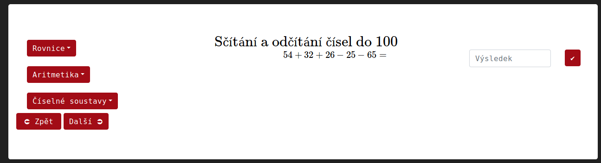
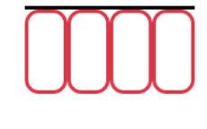
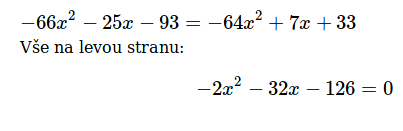

<h1>Uživatelská dokumentace</h1>
Toto je návod k použití aplikace Computatis na procvičování matematiky.\ \
V aplikaci je několik okruhů, ve kterých si můžete zvolit příklad k procvičování, který se vám bude náhodně generovat.
Výběr okruhů se provádí pomocí tlačítek, které rozbalují seznam možných příkladů.\
\
Tato tlačítka se nacházejí v levé části tohoto bílého boxu.\
\
V pravé části se vám zobrazují zvolené příklady. Úplně vpravo můžete zadat výsledek do formuláře.

Příklady se generují náhodně, ale jejich výsledek je vždy jednoznačný. Většinou je celočíselný (s výjimkou příkladu "Lineární rovnice", kde je povolen i výsledek končící na .5 a .25) nebo slovní. Po potvrzení výsledku buď klávesou "Enter", nebo tlačítkem vedle formuláře na výsledek, se vám zobrazí zpráva, zda je váš výsledek správný a v případě, že tomu tak není, se vám zobrazí i spravná odpověď.

Pokud si nejste jist/a s postupem řešení, je možné kliknout na tlačítko nápovědy. Nápovědy se od sebe liší. Některé zobrazí část postupu, jiné zobrazí formulář, který má červený okraj. Tento okraj zezelená, pokud je váš mezivýsledek správný (tento typ můžete najít například v příkladu "[Násobení](https://kubajj.gitlab.io/computatis/#/procvicovani/nasobeni)").

 
V dolní levé části bílého boxu se nacházejí tlačítka Zpět a Další.\	

##Nápovědy
Př.: <h3>Nápovědy v příkladu Kvadratická rovnice<h3>
První nápověda vám ukáže rovnici uplavenou do obvyklého tvaru: ax2 + bx + c = 0.
\
Další nápovědy se liší v závislosti na tom, jak rovnice vyšla.\
a) Diskriminant\
	Tyto nápovědy se zobrazí, pokud základní tvar rovnice má všechny 3 členy (a, b, c).\
	\
	Následuje ukázání vzorce pro diskriminant.\
	\
	Po stlačení tlačítka OK se źobrazí vzorec pro diskriminant s formuláři, které kontrolují mezivýpočty.\
	\
	Pokud jsou správně vyplněny, okraj jim zezelená.
	\
	Poté stačí jen upravit zlomek a zapsat výsledky.\
b) Rozklad\
	Tyto nápovědy se zobrazí, pokud základní tvar rovnice nemá absolutní člen.\
	\
	Tento typ nápovědy vytkne x před závorku. Jeden výsledek bude tedy 0 a druhý vyjde, pokud je hodnota závorky rovna 0.\
	\
c) Odmocnení\
	Tyto nápovědy se zobrazí, pokud základní tvar rovnice nemá lineární člen.\
	\
	Tento typ nápovědy převede absolutní člen na druhou stranu rovnice. Výsledek vyjde po odmocnění absolutního členu (výsledky budou 2 s opačným znaménkem).\
	\
